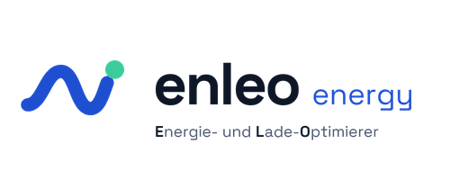
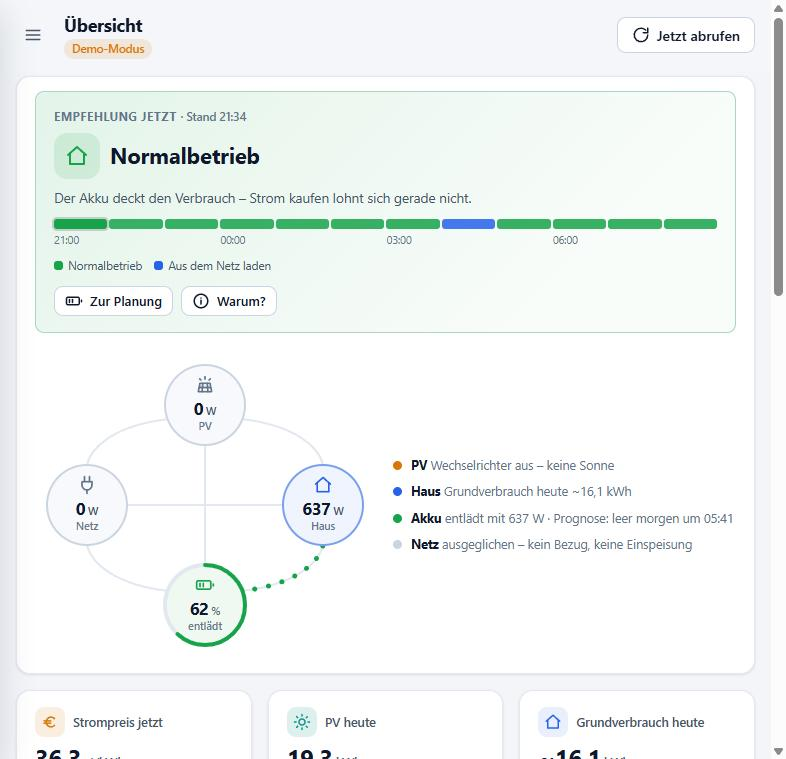
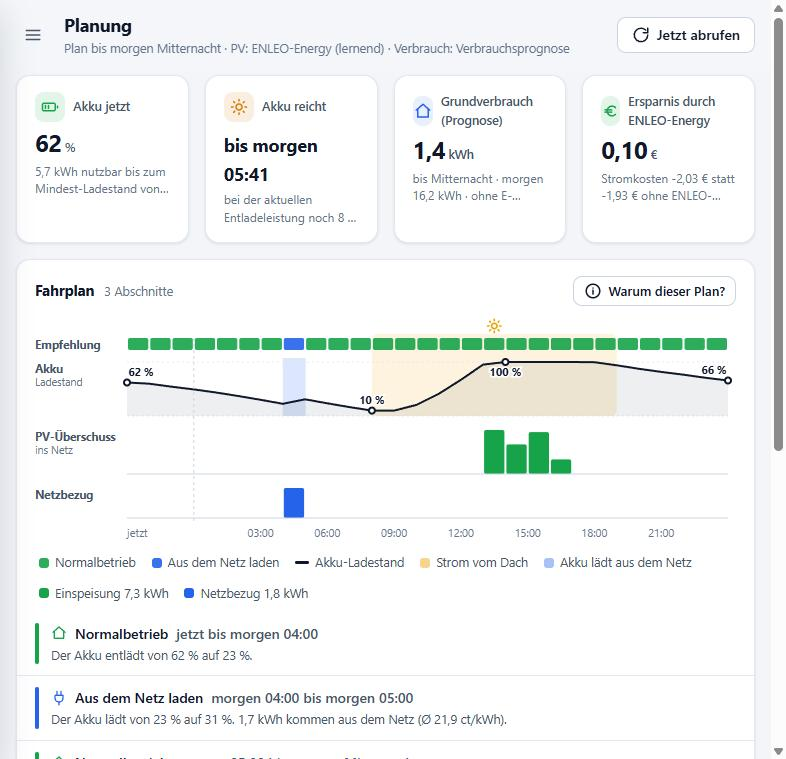
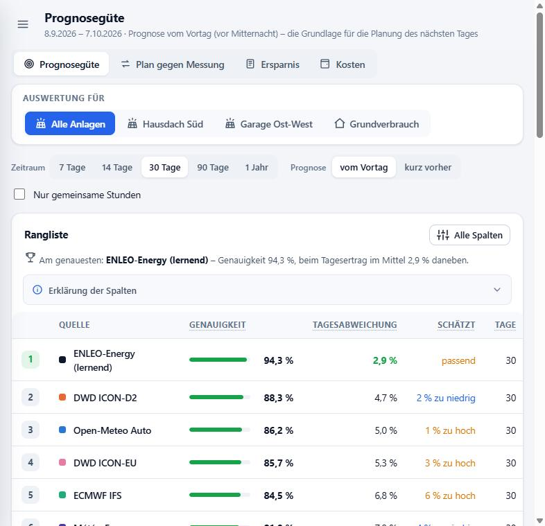
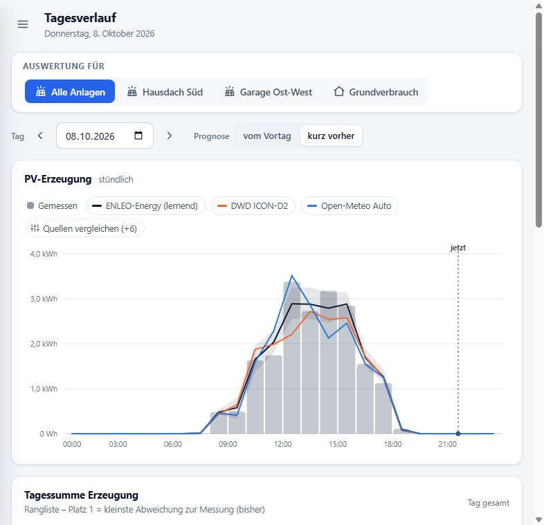
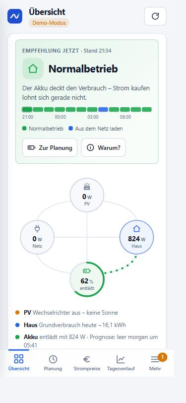
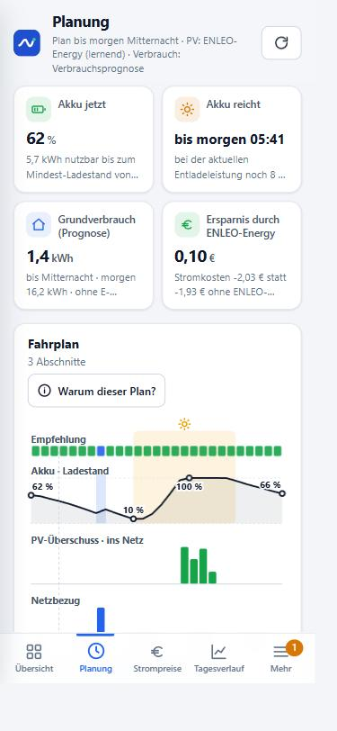

<p align="center">
  
</p>

<p align="center">
  <b>Energie- und Lade-Optimierer für Home Assistant</b><br>
  PV-Prognose, die aus deinen Messwerten lernt · Fahrplan für den Heimspeicher · dynamischer Strompreis
</p>

<p align="center">
  <a href="https://my.home-assistant.io/redirect/supervisor_add_addon_repository/?repository_url=https%3A%2F%2Fgithub.com%2FTelo87%2Fha-enleo-energy"></a>
</p>

> [!IMPORTANT]
> **🧪 ENLEO-Energy ist in der Testphase.**
> Das Add-on **prognostiziert, plant und empfiehlt** – es **steuert den Speicher noch nicht**. Die automatische
> Steuerung folgt, sobald die Auswertungen über einen längeren Zeitraum zeigen, dass Prognose und Planung
> verlässlich sind. Bis dahin ändert ENLEO-Energy nichts an deiner Anlage und legt keine Entitäten in
> Home Assistant an. Rückmeldungen sind willkommen: [Fehler melden oder Idee vorschlagen](https://github.com/Telo87/ha-enleo-energy/issues).

## Was ENLEO-Energy macht

Welche PV-Prognose stimmt bei **deinem** Dach – und wann lohnt es sich, den Akku zu halten oder günstig aus dem
Netz zu laden? ENLEO-Energy ist ein Add-on für Home Assistant. Es sammelt stündlich die Prognosen mehrerer
Wetterdienste, vergleicht sie mit der tatsächlichen Erzeugung jeder Photovoltaik-Anlage, lernt daraus eine eigene
Prognose und plant mit dynamischen Strompreisen (EPEX Day-Ahead) den günstigsten Fahrplan für den Batteriespeicher.
Jede Empfehlung wird festgehalten und mit den echten Messwerten nachgerechnet.

Alles läuft **lokal** auf deinem Home Assistant. Es braucht kein Konto und keine Cloud.

## So sieht es aus

| Übersicht | Planung |
|---|---|
|  |  |
| **Empfehlung für jetzt**, Energiefluss zwischen PV, Haus, Akku und Netz | **Fahrplan** bis morgen Mitternacht: Betriebsart, Ladestand, Überschuss und Netzbezug |

| Prognosegüte | Tagesverlauf |
|---|---|
|  |  |
| **Rangliste** aller Quellen nach Genauigkeit an deinen Anlagen | **Stunde für Stunde**: Messung, eigene Prognose und Wettermodelle |

<p align="center">
  
  &nbsp;&nbsp;
  
  <br><sub>Auf dem Handy – auf Wunsch als eigene App auf dem Home-Bildschirm. Die Bilder zeigen den Demo-Modus mit erfundenen Daten.</sub>
</p>

## Funktionen

### ☀️ PV-Prognose
- **Mehrere PV-Anlagen** mit eigenem Messsensor, auch mit mehreren Ausrichtungen an einem Wechselrichter (z. B. Ost-West)
- **Prognosequellen:** DWD ICON-D2 und ICON-EU, ECMWF, NOAA GFS, Météo-France, KNMI Harmonie, DMI Harmonie und weitere über Open-Meteo (kostenlos), Forecast.Solar, optional Solcast
- **Eigene, lernende Prognose:** gewichtet die Quellen nach ihrer Treffsicherheit bei deinen Anlagen und lernt Verschattung und Abregelung getrennt für Sonne und Wolken – mit Spanne (P10–P90) und Live-Korrektur nach der Erzeugung der letzten Stunde
- **Sofortiger Rückblick:** Messwerte aus der Langzeitstatistik von Home Assistant und archivierte Modellprognosen der letzten 90 Tage – die Rangliste steht nach wenigen Minuten

### 🔋 Planung für den Heimspeicher
- **Fahrplan** so weit Strompreise bekannt sind – Normalbetrieb, Akku halten oder aus dem Netz laden – mit Ersparnis gegenüber „ohne Eingriff“
- **„Warum dieser Plan?“** erklärt jede Entscheidung: wann der Akku sonst leer wäre, für welche Stunden Energie aufgehoben wird und was das je kWh bringt
- **Lernt deine Anlage kennen:** Wirkungsgrad und Regelverhalten des Speichers, Anteil eines Heizstabs am Überschuss, Vorsicht beim PV-Ertrag aus ganzen Tagen
- **Verbrauchsprognose** für den Grundverbrauch (ohne E-Auto und Heizstab) nach Uhrzeit, Werktag/Wochenende/Feiertag und Temperatur

### 📊 Auswertung
- **Prognosegüte:** Genauigkeit je Quelle, für die Prognose vom Vortag und die kurz vorher, nach Wetterlage und je Anlage – plus Entwicklung über die Zeit
- **Plan gegen Messung:** was geplant war und was gemessen wurde, für PV, Grundverbrauch, Netzbezug, Einspeisung und Ladestand
- **Ersparnis:** jede Empfehlung wird festgehalten und nachgerechnet – ohne ENLEO-Energy, mit ENLEO-Energy, im Nachhinein optimal
- **Ausrichtung prüfen:** erkennt aus den Messwerten, ob Ausrichtung, Neigung und Systemwirkungsgrad einer Anlage stimmen

### 💶 Strompreis und Kosten
- **Strompreise:** EPEX Day-Ahead in Viertelstunden mit den Aufschlägen deines Tarifs, günstigste Zeitfenster
- **Kosten:** echte Stromkosten pro Tag und Monat, bezahlter Durchschnittspreis gegenüber dem Börsendurchschnitt, Autarkie
- **Tarifvergleich** (abschaltbar) mit einem Festpreistarif oder einer Flat mit Freistrom-Kontingent
- **Einspeisevergütung je Anlage**, aufgeteilt nach Anlagenleistung oder gemessener Erzeugung

### 🛠️ Betrieb
- **Systemprüfung:** prüft Sensoren, Einheiten, Vorzeichen, Anlagenleistung, Tarif, Batterie und die Energiebilanz – mit Link zur passenden Einstellung
- **Als App auf dem Handy:** Direktzugriff mit Passwort, ohne das Menü von Home Assistant
- **Datensicherung:** alle Daten und Einstellungen als eine Datei exportieren und wieder einspielen
- **Hell und dunkel**, sechs Akzentfarben

## Was noch nicht geht

| | |
|---|---|
| 🚧 **Steuerung des Speichers** | ENLEO-Energy empfiehlt, schaltet aber nichts. Die automatische Steuerung ist der nächste große Schritt. |
| 🚧 **E-Auto-Ladeplan** | Das Laden des E-Autos wird gemessen und herausgerechnet, aber noch nicht geplant. |

## Installation

**Voraussetzung:** Home Assistant OS oder Supervised (Add-ons werden von Home Assistant Container und Core nicht unterstützt), Gerät mit 64 Bit (amd64 oder aarch64, z. B. Raspberry Pi 4/5).

1. Den Knopf oben anklicken – oder in Home Assistant **Einstellungen › Add-ons › Add-on-Store › ⋮ › Repositories** öffnen und diese Adresse hinzufügen:
   ```
   https://github.com/Telo87/ha-enleo-energy
   ```
2. **ENLEO-Energy** im Store auswählen, installieren und starten.
3. „In der Seitenleiste anzeigen“ einschalten und die Oberfläche öffnen.
4. Eine PV-Anlage mit Leistung, Ausrichtung und Messsensor anlegen. Unter **Systemprüfung** steht, was noch fehlt.

Die ausführliche Anleitung steht im Add-on unter **Dokumentation**, die Neuerungen jeder Version im [Changelog](enleo/CHANGELOG.md).

## Datenschutz

ENLEO-Energy rechnet lokal. Nach außen gehen nur die Abfragen bei den Prognose- und Preisdiensten (mit deinem
Standort) und einmal am Tag (sowie nach einem Update) eine **Versionsprüfung**, die ausschließlich die Versionsnummer sendet – keine Kennung,
keine Messwerte, keine Einstellungen. Sie lässt sich unter Einstellungen › System abschalten.

## Lizenz

[PolyForm Strict 1.0.0](LICENSE) – die Nutzung für nicht-kommerzielle Zwecke ist erlaubt (privat, Hobby,
gemeinnützige Organisationen). Weitergabe, Veränderung und darauf aufbauende Werke sind nicht erlaubt.

---

<sub><b>English summary:</b> ENLEO-Energy is a Home Assistant add-on for photovoltaic systems with a home battery and a
dynamic electricity tariff. It compares solar forecasts from several weather models with the measured production of
each PV array, learns its own forecast from that, forecasts the household consumption and plans the battery
(self-consumption, hold, charge from the grid) against EPEX day-ahead prices. Currently in a test phase: it
forecasts, plans and recommends, but does not control the battery yet. The user interface is in German.</sub>
